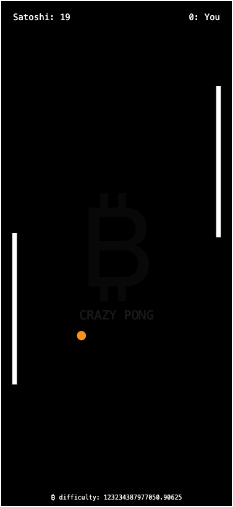

# 🏓 Bitcoin Crazy Pong

Welcome to the most volatile Pong game in the universe! Where the difficulty is as unpredictable as Bitcoin's price action. 

**🎮 [Play Now!](https://turinglabsorg.github.io/bitcoin-crazy-pong)**

## 🎮 What's This Madness?

This isn't your grandpa's Pong. This is **Bitcoin Crazy Pong**, where:
- The AI opponent is literally Satoshi Nakamoto
- The game's difficulty scales with real Bitcoin mining difficulty
- The ball is Bitcoin orange and gets smaller when moving fast (just like your portfolio in a bear market)
- Your paddle momentum affects the ball's trajectory (HODL steady!)

## 🕹️ How to Play

- **Desktop**: Use Up/Down arrow keys
- **Mobile**: Slide your finger up/down
- **Pro tip**: Move your paddle while hitting for extra momentum (like adding leverage to your trades)

## 🤖 About Your Opponent

You're playing against Satoshi's AI, and just like Bitcoin mining, it gets harder as the network difficulty increases. The AI's behavior is directly tied to the current Bitcoin mining difficulty - when miners are sweating, you'll be sweating too!

## 🎯 Features

- Real-time Bitcoin mining difficulty integration
- Dynamic ball physics with momentum
- Responsive design for both desktop and mobile
- Retro monospace aesthetic
- Bitcoin-themed visuals and effects

## 🏆 Can You Beat Satoshi?

Probably not. Just like trying to figure out who Satoshi really is, beating them at Pong is pretty much impossible. But hey, at least you can have fun trying!

## 🚀 Ready to Play?

Head over to [https://turinglabsorg.github.io/bitcoin-crazy-pong](https://turinglabsorg.github.io/bitcoin-crazy-pong) and start playing! No wallet needed, just your gaming skills and a bit of luck with the mining difficulty.

## ⚡ Fun Fact

The ball's speed is probably still slower than Lightning Network transactions. ⚡️

---
*Disclaimer: No actual bitcoins were harmed in the making of this game.*
